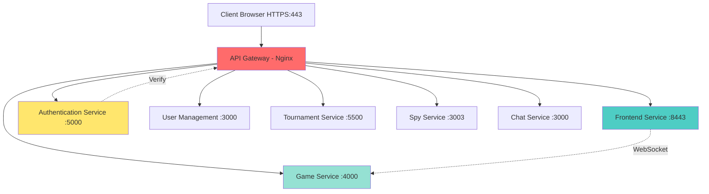
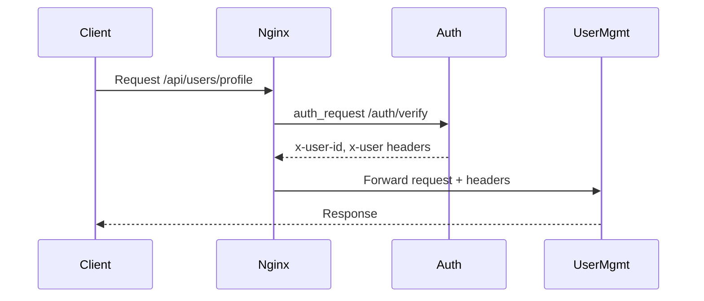
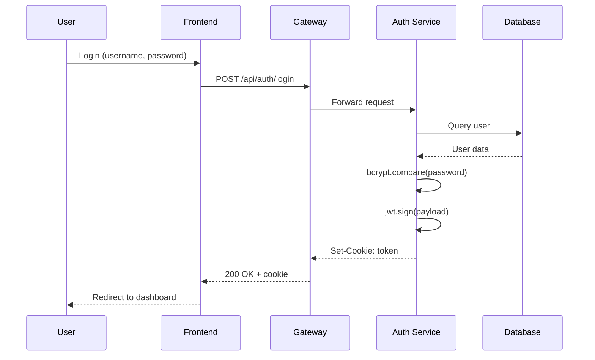
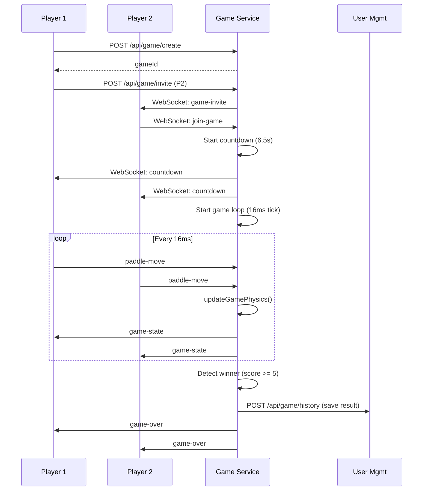
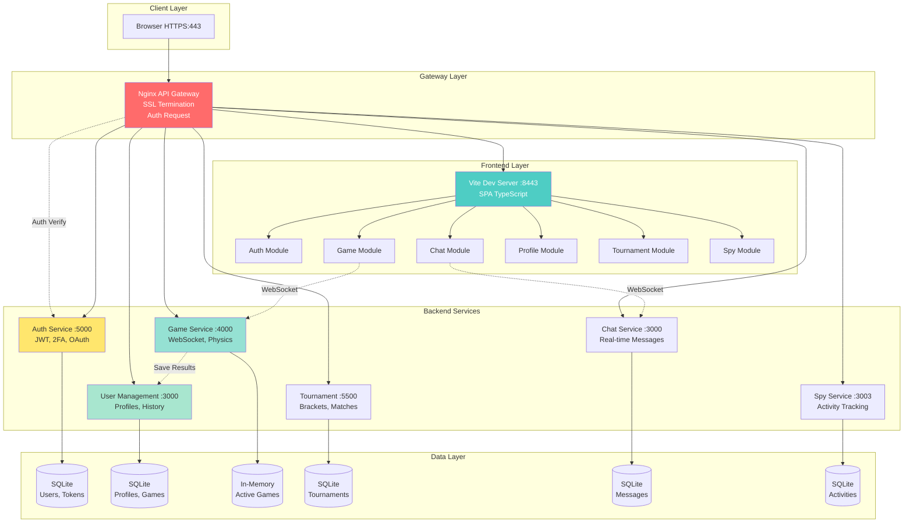

# 📚 Documentation Complète du Projet ft_transcendence (Trandandan)

## 🎯 Vue d'Ensemble du Projet

**ft_transcendence** est une application web moderne de jeu **Pong multijoueur** construite avec une **architecture microservices**. Le projet implémente un jeu classique de Pong avec des fonctionnalités avancées incluant l'authentification, le chat, les tournois, le matchmaking en ligne, et un système de surveillance des joueurs.

---

## 🏗️ Architecture Globale

### Architecture Microservices

Le projet suit une **architecture microservices** avec séparation claire des responsabilités :



### Principe de Séparation des Préoccupations

Chaque microservice a une **responsabilité unique** :

1. **API Gateway (Nginx)** - Point d'entrée unique, routage, SSL/TLS, authentification centralisée
2. **Frontend** - Interface utilisateur SPA (Single Page Application)
3. **Authentication** - Gestion des identités, JWT, OAuth, 2FA
4. **User Management** - Profils utilisateurs, avatars, historique de jeux
5. **Game Service** - Logique de jeu temps réel avec WebSockets
6. **Tournament Service** - Organisation de tournois
7. **Spy Service** - Surveillance des activités des joueurs
8. **Chat Service** - Messagerie en temps réel

---

## 🔧 Technologies Utilisées

### Frontend

| Technologie | Version | Usage |
|------------|---------|-------|
| **Vite** | 7.2.4 | Build tool moderne et rapide pour le développement |
| **TypeScript** | 5.9.3 | Typage statique pour JavaScript |
| **TailwindCSS** | 4.1.16 | Framework CSS utility-first pour le styling |
| **Socket.IO Client** | 4.8.1 | Communication WebSocket temps réel |
| **Axios** | 1.13.2 | Client HTTP pour les requêtes API |

**Idées appliquées** :
- ✅ **SPA (Single Page Application)** - Navigation fluide sans rechargement
- ✅ **Module Federation** - Organisation modulaire par fonctionnalité
- ✅ **Hot Module Replacement** - Développement rapide avec Vite

### Backend - Stack Commune

Tous les microservices backend utilisent :

| Technologie | Version | Usage |
|------------|---------|-------|
| **Node.js** | - | Runtime JavaScript côté serveur |
| **Fastify** | 4.x - 5.x | Framework web ultra-rapide (alternative à Express) |
| **SQLite / better-sqlite3** | 9.x - 12.x | Base de données embarquée |
| **JWT (jsonwebtoken)** | 9.0.x | Authentification stateless |
| **Docker** | - | Containerisation |

**Pourquoi Fastify ?**
- ⚡ **Performance** : 2-3x plus rapide qu'Express
- 🔒 **Sécurité** : Validation de schéma intégrée
- 🚀 **Moderne** : Support natif async/await

### Services Spécifiques

#### 1. Authentication Service (Port 5000)

**Technologies** :
- `bcrypt` - Hachage sécurisé des mots de passe
- `speakeasy` - Génération de codes 2FA (TOTP)
- `qrcode` - Génération de QR codes pour 2FA
- `nodemailer` - Envoi d'emails de vérification
- `@fastify/cookie` - Gestion des cookies sécurisés

**Idées appliquées** :
- ✅ **JWT Tokens** - Authentification sans état (stateless)
- ✅ **2FA (Two-Factor Authentication)** - Sécurité renforcée
- ✅ **OAuth Integration** - Connexion via services tiers
- ✅ **Cookie-based Auth** - Stockage sécurisé des tokens

#### 2. User Management Service (Port 3001)

**Technologies** :
- `@fastify/multipart` - Upload de fichiers (avatars)
- `@fastify/rate-limit` - Protection contre les abus
- `@fastify/static` - Servir les fichiers statiques
- `sqlite3` - Stockage des profils utilisateurs

**Idées appliquées** :
- ✅ **File Upload** - Gestion d'avatars personnalisés
- ✅ **Rate Limiting** - Protection DDoS
- ✅ **User Profiles** - Système de profils complet
- ✅ **Game History** - Statistiques et historique des matchs

#### 3. Game Service (Port 4000)

**Technologies** :
- `fastify-socket.io` - WebSockets pour le temps réel
- `socket.io` - Communication bidirectionnelle
- `axios` - Communication inter-services

**Idées appliquées** :
- ✅ **Server-Authoritative Game Logic** - Le serveur contrôle la physique du jeu
- ✅ **Real-time Multiplayer** - Jeu en temps réel via WebSockets
- ✅ **Game State Synchronization** - Synchronisation de l'état du jeu
- ✅ **Matchmaking System** - Système d'invitations et de matchs
- ✅ **Physics Engine** - Moteur physique côté serveur (collision, mouvement)
- ✅ **Tick Rate System** - Boucle de jeu à 60 FPS (~16ms par tick)

**Architecture du Game Service** :

```javascript
// Constantes physiques
CANVAS_WIDTH = 800
CANVAS_HEIGHT = 600
PADDLE_HEIGHT = 100
PADDLE_WIDTH = 10
BALL_SPEED = 4
BALL_RADIUS = 10
TICK_RATE = 16ms (~60 FPS)
```

**Flux de jeu** :
1. Joueur A crée une partie → génère un `gameId`
2. Joueur A invite Joueur B via WebSocket
3. Les deux joueurs rejoignent la room Socket.IO
4. Countdown de 6.5 secondes
5. Boucle de jeu démarre (updateGamePhysics toutes les 16ms)
6. Synchronisation de l'état vers les clients
7. Détection de victoire (premier à 5 points)
8. Sauvegarde du résultat dans User Management

#### 4. Tournament Service (Port 5500)

**Technologies** :
- `better-sqlite3` - Stockage des tournois
- `bcrypt` - Sécurisation des tournois privés

**Idées appliquées** :
- ✅ **Tournament Brackets** - Système de tournois à élimination
- ✅ **Participant Management** - Gestion des inscriptions
- ✅ **Tournament State Machine** - États : pending, in-progress, completed

#### 5. Chat Service (Port 3000)

**Technologies** :
- `fastify-socket.io` - Chat temps réel
- `better-sqlite3` - Historique des messages
- `TypeScript` - Typage pour la sécurité

**Idées appliquées** :
- ✅ **Real-time Messaging** - Messages instantanés
- ✅ **Chat Rooms** - Salons de discussion
- ✅ **Message Persistence** - Historique sauvegardé

#### 6. Spy Service (Port 3003)

**Technologies** :
- `better-sqlite3` - Stockage des activités
- `TypeScript` - Code type-safe

**Idées appliquées** :
- ✅ **Activity Tracking** - Surveillance des joueurs en ligne
- ✅ **Player Status** - Statut en temps réel (online, in-game, offline)

### Infrastructure & DevOps

#### API Gateway - Nginx

**Configuration** :
```nginx
# SSL/TLS Termination
listen 443 ssl;
ssl_certificate /etc/nginx/certs/certificate.crt;
ssl_certificate_key /etc/nginx/certs/private.key;
ssl_protocols TLSv1.2 TLSv1.3;

# Reverse Proxy avec Load Balancing
upstream game-service {
    server game-service:4000;
    keepalive 32;
}
```

**Idées appliquées** :
- ✅ **Reverse Proxy** - Routage centralisé
- ✅ **SSL/TLS Termination** - Chiffrement HTTPS
- ✅ **Auth Request Module** - Vérification centralisée des tokens
- ✅ **WebSocket Proxying** - Support des connexions WebSocket
- ✅ **Connection Pooling** - `keepalive 32` pour réutiliser les connexions
- ✅ **Request Routing** - Routage basé sur les paths (`/api/game/`, `/socket.io/`)

**Flux d'authentification** :


#### Docker & Docker Compose

**Idées appliquées** :
- ✅ **Containerisation** - Isolation des services
- ✅ **Multi-stage Builds** - Optimisation des images
- ✅ **Docker Networks** - Communication inter-conteneurs
- ✅ **Volume Mounting** - Persistance des données
- ✅ **Hot Reload** - Volumes montés pour le développement

**Configuration Docker Compose** :
```yaml
services:
  # 7 microservices
  - user-management
  - authentication
  - front-end
  - spy-service
  - tournament
  - game-service
  - chat-service
  - api-gateway

networks:
  app-network:
    driver: bridge

volumes:
  nginx_certs:
```

**Makefile pour la gestion** :
```makefile
up:     # docker compose up --build
down:   # docker compose down -v --remove-orphans
restart: # docker compose restart
fclean: # Nettoyage complet (stop, rm, rmi)
```

---

## 💡 Concepts et Patterns Appliqués

### 1. Architecture Patterns

#### Microservices Architecture
- **Avantages** :
  - Scalabilité indépendante de chaque service
  - Isolation des pannes
  - Déploiement indépendant
  - Technologie hétérogène possible

#### API Gateway Pattern
- Point d'entrée unique
- Authentification centralisée
- Rate limiting
- SSL termination

#### Service Mesh (simplifié)
- Communication inter-services via Docker network
- Service discovery via noms de conteneurs

### 2. Security Patterns

#### JWT (JSON Web Tokens)
```javascript
// Génération du token
const token = jwt.sign(
  { userId, username }, 
  SECRET_KEY, 
  { expiresIn: '24h' }
);

// Vérification
const decoded = jwt.verify(token, SECRET_KEY);
```

**Avantages** :
- ✅ Stateless (pas de session serveur)
- ✅ Scalable horizontalement
- ✅ Contient les claims utilisateur

#### Auth Request Pattern (Nginx)
- Vérification centralisée avant chaque requête
- Injection des headers `x-user-id` et `x-user`
- Évite la duplication de la logique d'auth

#### Password Hashing (bcrypt)
```javascript
const hashedPassword = await bcrypt.hash(password, 10);
const isValid = await bcrypt.compare(password, hashedPassword);
```

#### Two-Factor Authentication (2FA)
- TOTP (Time-based One-Time Password)
- QR Code pour configuration
- Backup codes

### 3. Real-time Communication Patterns

#### WebSocket avec Socket.IO
```javascript
// Serveur
io.on('connection', (socket) => {
  socket.on('paddle-move', (data) => {
    // Update game state
    socket.to(gameRoom).emit('game-state', state);
  });
});

// Client
socket.emit('paddle-move', { y: paddleY });
socket.on('game-state', (state) => {
  // Render game
});
```

**Avantages** :
- ✅ Communication bidirectionnelle
- ✅ Faible latence
- ✅ Rooms pour isolation des parties
- ✅ Fallback automatique (polling si WebSocket indisponible)

#### Server-Authoritative Game Logic
- Le serveur est la source de vérité
- Prévient la triche
- Clients envoient uniquement les inputs
- Serveur calcule la physique et broadcast l'état

### 4. Data Patterns

#### SQLite pour Persistance
- Base de données embarquée
- Pas de serveur DB séparé
- Parfait pour les microservices
- Fichier unique par service

#### File Upload Pattern
```javascript
// Multipart form data
const data = await request.file();
await pump(data.file, fs.createWriteStream(filepath));
```

### 5. Development Patterns

#### Hot Module Replacement (HMR)
- Vite pour le frontend
- Nodemon pour le backend
- Volumes Docker montés
- Développement rapide sans rebuild

#### Environment Variables
```bash
# .env files
JWT_SECRET=xxx
OAUTH_CLIENT_ID=xxx
INTERNAL_SECRET=xxx
```

#### CORS Configuration
```javascript
await fastify.register(cors, {
  origin: ["https://localhost:443"],
  credentials: true,
  methods: ["GET", "POST", "PUT", "DELETE"]
});
```

---

## 🎮 Fonctionnalités Implémentées

### 1. Authentification & Sécurité
- ✅ Inscription / Connexion
- ✅ OAuth (42, Google, etc.)
- ✅ 2FA (TOTP)
- ✅ JWT Tokens
- ✅ Cookie-based sessions
- ✅ Email verification
- ✅ Password reset

### 2. Gestion Utilisateur
- ✅ Profils utilisateurs
- ✅ Upload d'avatars
- ✅ Historique des matchs
- ✅ Statistiques (victoires, défaites, ratio)
- ✅ Classement

### 3. Jeu Pong
- ✅ Mode local (1v1 sur même écran)
- ✅ Mode en ligne (multijoueur)
- ✅ Physique réaliste
- ✅ Système d'invitations
- ✅ Matchmaking
- ✅ Countdown avant match
- ✅ Score en temps réel
- ✅ Détection de victoire
- ✅ Sauvegarde des résultats

### 4. Tournois
- ✅ Création de tournois
- ✅ Inscription aux tournois
- ✅ Brackets à élimination
- ✅ Tournois publics/privés
- ✅ Gestion des participants

### 5. Chat
- ✅ Messagerie temps réel
- ✅ Salons de discussion
- ✅ Historique des messages
- ✅ Notifications

### 6. Surveillance
- ✅ Statut des joueurs (online/offline/in-game)
- ✅ Tracking des activités
- ✅ Liste des joueurs en ligne

---

## 🔄 Flux de Données Typiques

### Flux d'Authentification



### Flux de Match en Ligne



---

## 📁 Structure du Projet

```
trandandan/
├── frontend/                    # Frontend SPA
│   ├── auth_frontend/          # Module d'authentification
│   ├── chat-frontend/          # Module de chat
│   ├── game_frontend/          # Module de jeu
│   ├── profile_frontend/       # Module de profil
│   ├── spy_frontend/           # Module de surveillance
│   ├── tournament_frontend/    # Module de tournois
│   ├── socket_manager/         # Gestionnaire WebSocket
│   ├── index.html              # Point d'entrée
│   ├── vite.config.js          # Configuration Vite
│   └── package.json
│
├── backend/                     # Microservices backend
│   ├── Auth/                   # Service d'authentification
│   │   ├── server.js
│   │   ├── controllers/
│   │   ├── Routes/
│   │   └── DataBase/
│   │
│   ├── user-management/        # Service de gestion utilisateurs
│   │   ├── src/server.js
│   │   └── data/
│   │
│   ├── game-service/           # Service de jeu
│   │   ├── src/server.js
│   │   └── .env
│   │
│   ├── tournament/             # Service de tournois
│   │   ├── server.js
│   │   └── data/
│   │
│   ├── chat-service/           # Service de chat
│   │   ├── src/server.ts
│   │   └── tsconfig.json
│   │
│   └── spy-service/            # Service de surveillance
│       └── src_spy_service/
│
├── api-gateway/                # Nginx reverse proxy
│   ├── Dockerfile
│   ├── api-gateway.conf        # Configuration Nginx
│   └── ssl_script.sh           # Génération certificats SSL
│
├── docker-compose.yml          # Orchestration des services
├── Makefile                    # Commandes de gestion
└── package.json                # Dépendances racine
```

---

## 🚀 Déploiement & Utilisation

### Commandes Principales

```bash
# Démarrer tous les services
make up

# Arrêter tous les services
make down

# Redémarrer
make restart

# Nettoyage complet
make fclean

# Rebuild et redémarrage
make re
```

### Ports Exposés

| Service | Port Interne | Port Externe | Protocole |
|---------|--------------|--------------|-----------|
| API Gateway | 443 | 443 | HTTPS |
| Frontend | 8443 | - | HTTP (interne) |
| Auth | 5000 | 5000 | HTTP |
| User Management | 3000 | 3001 | HTTP |
| Game Service | 4000 | 4000 | HTTP + WS |
| Tournament | 5500 | 5500 | HTTP |
| Spy Service | 3003 | 3003 | HTTP |
| Chat Service | 3000 | - | HTTP + WS |

### Accès à l'Application

```
https://localhost:443
```

---

## 🎨 Idées Clés du Projet

### 1. **Séparation Frontend Modulaire**
Chaque fonctionnalité (auth, chat, game, profile) est un module séparé, facilitant la maintenance et le développement parallèle.

### 2. **Server-Authoritative Game**
La logique de jeu est entièrement côté serveur, empêchant la triche et garantissant la cohérence.

### 3. **Authentification Centralisée**
Nginx vérifie l'authentification avant de router vers les services, évitant la duplication de code.

### 4. **Real-time First**
WebSockets pour le jeu, le chat, et les notifications en temps réel.

### 5. **Containerisation Complète**
Tous les services sont dockerisés, garantissant la reproductibilité et facilitant le déploiement.

### 6. **Sécurité Multi-couches**
- SSL/TLS pour le transport
- JWT pour l'authentification
- bcrypt pour les mots de passe
- 2FA pour la sécurité renforcée
- Rate limiting pour la protection DDoS

### 7. **Scalabilité Horizontale**
Grâce à l'architecture microservices et JWT stateless, chaque service peut être scalé indépendamment.

---

## 📊 Diagramme d'Architecture Complet



---

## 🔍 Points Techniques Avancés

### 1. Game Loop Implementation

```javascript
// Boucle de jeu à 60 FPS
const TICK_RATE = 16; // ~60 FPS

function startGameLoop(gameId) {
    const interval = setInterval(() => {
        updateGamePhysics(gameId);
        const game = games.get(gameId);
        io.to(gameId).emit('game-state', {
            ball: game.ball,
            paddles: game.paddles,
            scores: game.scores
        });
        
        if (game.scores.player1 >= 5 || game.scores.player2 >= 5) {
            stopGameLoop(gameId);
            saveMatchResult(game);
        }
    }, TICK_RATE);
}
```

### 2. Collision Detection

```javascript
function updateGamePhysics(gameId) {
    const game = games.get(gameId);
    
    // Ball movement
    game.ball.x += game.ball.vx;
    game.ball.y += game.ball.vy;
    
    // Wall collision
    if (game.ball.y <= 0 || game.ball.y >= CANVAS_HEIGHT) {
        game.ball.vy *= -1;
    }
    
    // Paddle collision
    if (checkPaddleCollision(game.ball, game.paddles.player1)) {
        game.ball.vx *= -1;
        game.ball.x = game.paddles.player1.x + PADDLE_WIDTH;
    }
    
    // Score detection
    if (game.ball.x <= 0) {
        game.scores.player2++;
        resetBall(game);
    }
}
```

### 3. Nginx Auth Request Flow

```nginx
location /api/users/ {
    # Sous-requête d'authentification
    auth_request /auth/verify;
    
    # Récupération des headers de l'auth service
    auth_request_set $user_id $upstream_http_x_user_id;
    auth_request_set $user $upstream_http_x_user;
    
    # Injection dans la requête finale
    proxy_set_header x-user-id $user_id;
    proxy_set_header x-user $user;
    
    proxy_pass http://user-management/;
}
```

### 4. WebSocket Room Management

```javascript
io.on('connection', (socket) => {
    socket.on('join-game', ({ gameId, userId }) => {
        socket.join(gameId);
        onlineUsers.set(userId, socket.id);
        
        io.to(gameId).emit('player-joined', { userId });
    });
    
    socket.on('disconnect', () => {
        const userId = getUserIdFromSocket(socket.id);
        onlineUsers.delete(userId);
        io.emit('player-left', { userId });
    });
});
```

---

## 🎓 Concepts Pédagogiques

Ce projet illustre de nombreux concepts importants en développement web moderne :

1. **Architecture distribuée** - Microservices, API Gateway
2. **Temps réel** - WebSockets, Socket.IO
3. **Sécurité** - JWT, 2FA, SSL/TLS, bcrypt
4. **DevOps** - Docker, Docker Compose, Nginx
5. **Frontend moderne** - SPA, TypeScript, Vite, HMR
6. **Backend scalable** - Fastify, stateless auth
7. **Game development** - Physics, game loop, client-server sync
8. **Database** - SQLite, data persistence
9. **Networking** - HTTP, WebSocket, reverse proxy
10. **Software patterns** - Microservices, Gateway, Repository

---

## 📝 Conclusion

**ft_transcendence (Trandandan)** est un projet complet qui démontre la maîtrise de :

- ✅ **Architecture moderne** avec microservices
- ✅ **Technologies full-stack** (TypeScript, Node.js, Fastify, Vite)
- ✅ **Communication temps réel** (WebSockets)
- ✅ **Sécurité** (JWT, 2FA, SSL/TLS)
- ✅ **DevOps** (Docker, Nginx)
- ✅ **Game development** (physique, synchronisation)

Le projet est **production-ready** avec :
- Containerisation complète
- HTTPS configuré
- Authentification robuste
- Architecture scalable
- Code modulaire et maintenable

---

**Technologies principales** : Node.js, Fastify, TypeScript, Vite, Socket.IO, Docker, Nginx, SQLite, JWT

**Patterns appliqués** : Microservices, API Gateway, Server-Authoritative Game, JWT Auth, WebSocket Real-time

**Fonctionnalités** : Authentification 2FA, Jeu Pong multijoueur, Tournois, Chat temps réel, Profils utilisateurs, Surveillance
